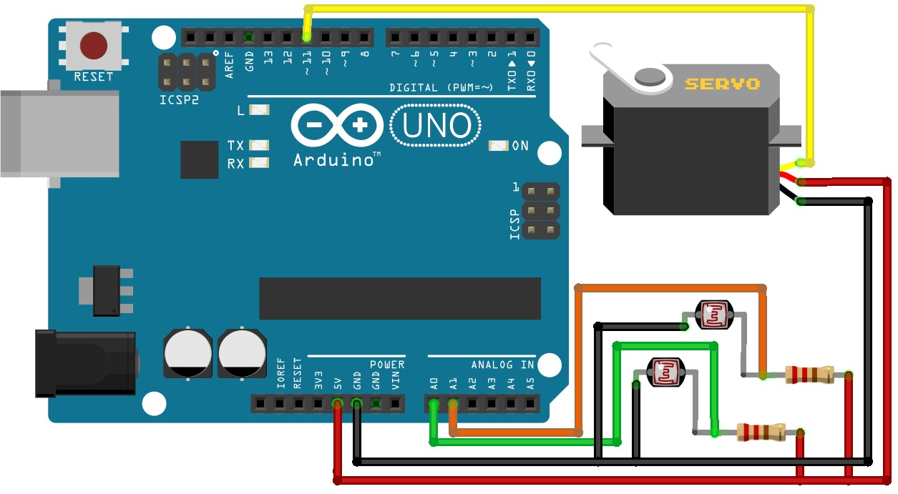

# Automatic Solar Tracker

## Project Description

This project demonstrates a simple Arduino-based solar tracking system.
Two LDR (Light Dependent Resistor) sensors are used to detect the direction of maximum sunlight.
Based on the light intensity difference between the two LDRs, a servo motor rotates the mini solar panel
to align it toward the strongest light source.

A 3.7V rechargeable battery is included to store energy from the solar panel and provide power to the system,
allowing it to operate even when sunlight is weak or unavailable.

This project is ideal for beginners who want to learn about Arduino, sensors, servo motors,
solar energy systems, and basic automation concepts.

---

## Components Required

| Component | Quantity |
|---------|----------|
| Arduino UNO Board | 1 |
| LDR Sensors | 2 |
| 220 Ohm Resistors | 2 |
| Servo Motor | 1 |
| Mini Solar Panel | 1 |
| 3.7V (Li-ion / LiPo) Battery | 1 |
| Jumper Wires | As required |

----

## 🖼️ Project Diagram

  

 

----

## Power System Description

- The mini solar panel is used to generate electrical energy from sunlight
- The generated energy can be stored in a 3.7V rechargeable battery
- The battery supplies power to the Arduino and servo motor when sunlight is insufficient
- This makes the system more reliable and suitable for continuous operation

> Note: A proper charging module (such as TP4056) and voltage regulation are recommended
> to safely charge the battery and protect the Arduino board.

---

## Servo Motor Library Installation (Required)

To control the servo motor, the Servo library must be installed in the Arduino IDE.

### Check if the Library is Already Installed

1. Open Arduino IDE
2. Go to File → Examples
3. Scroll down and check for "Examples from Custom Libraries"
4. If the Servo library appears there, it is already installed correctly

---

### Install or Update the Servo Library

1. Open Arduino IDE
2. Press Ctrl + Shift + I to open the Library Manager
3. In the search box, type:
   Servo
4. If not installed, click Install
5. If already installed, check for available updates and update if necessary

---

### If Errors Occur After Installation

- Close the Arduino IDE
- Reopen it and try again
- Compile and upload the code again

Most library-related issues are fixed by restarting the Arduino IDE.

---

## Working Principle

- Two LDR sensors detect light intensity from left and right directions
- Arduino compares both sensor values
- If one side receives more light, the servo motor rotates toward that direction
- The solar panel continuously aligns itself with the strongest light source
- The rechargeable battery stores excess energy for later use

---

## Applications

- Solar tracking systems
- Renewable energy projects
- Arduino learning projects
- Battery-powered embedded systems
- Automation and control system demonstrations