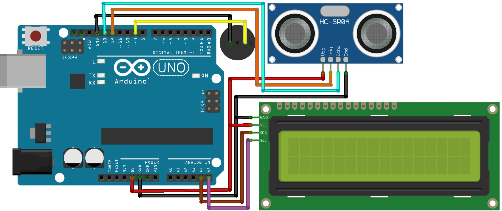

# 🚨 Automatic Water Level Alarm System

This project is an **Automatic Water Level Alarm System**. It uses an **ultrasonic sensor** to measure distance, displays the values on a **16x2 LCD with I2C module**, and triggers a **buzzer and servo motor** when an object comes within a predefined range. 
 
The system is powered using **rechargeable batteries** through a **DC jack and switch-based power system**.

---

## 🔧 Components Required

| Component | Quantity |
|---------|----------|
| Arduino UNO Board | 1 |
| Ultrasonic Sensor | 1 |
| Buzzer | 1  
| 16x2 LCD Display | 1 | 
| I2C Module | 1 |
| Servo Motor | 1 |
| Jumper Wires | As required |
| Double Battery Holder | 1 |
| DC Jack | 1 |
| Switch | 1 |
| 3.7V lithium ion Batteries | 2 |

----

## 🖼️ Project Diagram

  

 

----

## 📚 Required Arduino Libraries (Must Install)

The following libraries **must be installed before uploading the code**:

- **Servo**
- **NewPing**
- **LiquidCrystal I2C**

---

## 🔍 How to Check Library Installation

1. Open **Arduino IDE**
2. Go to **File → Examples**
3. Scroll down
4. If you see **Examples from Custom Libraries**, the libraries are installed correctly ✅

---

## 📥 How to Install Libraries

1. Open **Arduino IDE**
2. Press **Ctrl + Shift + I** to open **Library Manager**
3. In the **Search box**, type the following libraries one by one:
   - Servo  
   - NewPing  
   - LiquidCrystal I2C  
4. Click **Install** if not installed
5. If already installed, check for **updates** and update if available 🔄
6. If errors appear after installation:
   - Close Arduino IDE
   - Reopen Arduino IDE
   - Try again ⚠️

---

## 🔌 Power System Wiring Instructions

### 🔋 Double Battery Holder to DC Jack Connection

- The **red wire (positive)** and **black wire (negative)** from the **Double Battery Holder** must be connected to the **DC Jack**
- Connect the **red wire from the battery holder** to **one pin of the switch**
- Connect the **other pin of the switch** to the **positive terminal of the DC Jack**
- Connect the **black wire from the battery holder** directly to the **negative terminal of the DC Jack**

⚡ This allows safe ON/OFF control using the switch.

---

## 🖥️ LCD and I2C Module Setup (Important)

- The **I2C Module must be fixed under the 16x2 LCD Display**
- Ensure correct pin alignment before soldering or connecting
- Incorrect placement may damage the LCD or prevent communication ❌

---

## 🧠 Project Description

This system continuously measures distance using the ultrasonic sensor.

When an object comes within a predefined distance:

- 📢 The **buzzer** activates as an alert  
- 🔄 The **servo motor** rotates to a set angle  
- 📟 The **measured distance** is displayed on the **16x2 LCD**  

---

## 🎯 Applications

- Obstacle detection systems  
- Smart parking systems  
- Security alert systems  
- Arduino learning and educational projects 🎓  

---

## ✅ Notes

- Use fully charged **3.7V rechargeable batteries**
- Double-check all wiring before powering ON 🔍
- Install all required libraries before uploading the code