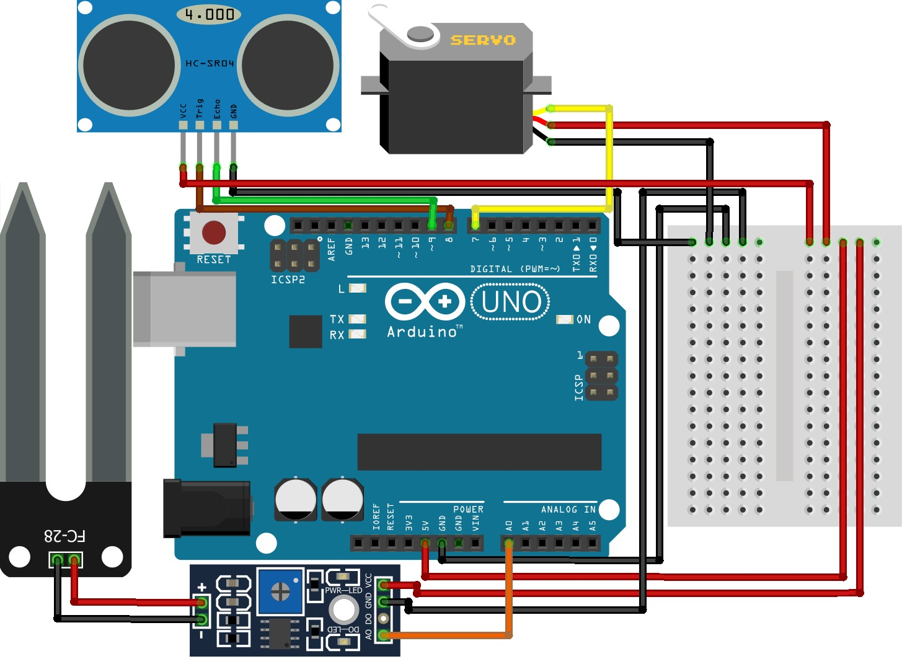

# Dry Wet Waste Segregator Dustbin ♻️

The **Dry Wet Waste Segregator Dustbin** is an automated system designed to detect and separate **dry** and **wet waste** using an **ultrasonic sensor** and a **soil moisture sensor**.  
This project helps improve waste management efficiency, reduces manual effort, and promotes better hygiene.

---

## 📌 Project Overview

The system works by:
- Detecting the presence of waste using an **ultrasonic sensor**
- Measuring moisture content using a **soil moisture sensor**
- Classifying waste as **Wet** or **Dry**
- Rotating a **servo motor** to direct waste into the appropriate bin

This project is ideal for **smart city**, **IoT**, and **automation** based waste management applications.

---

## 🧰 Components Required

- Arduino UNO Board x1
- Servo Motor x1
- Soil Moisture Sensor x1
- Ultrasonic Sensor (HC-SR04) x1
- Breadboard x1
- Jumper Wires  
- USB Cable x1

---

## 🖼️ Project Diagram

  

---

## ⚙️ Working Principle

1. The ultrasonic sensor detects an object placed in front of the system.
2. Once detected, the soil moisture sensor checks the moisture level of the waste.
3. If the moisture value exceeds a predefined threshold, the waste is classified as **Wet Waste**.
4. Otherwise, it is classified as **Dry Waste**.
5. The servo motor rotates to the corresponding position to segregate the waste.

---

## 🚀 Applications

- Smart Waste Management Systems  
- Smart Cities  
- Automated Garbage Segregation  
- Educational Arduino Projects  

---

## 🛠️ Future Improvements

- Add IoT connectivity for monitoring waste levels
- Use multiple bins for better segregation
- Integrate a display module for real-time status

---

### ✨ Developed using Arduino
