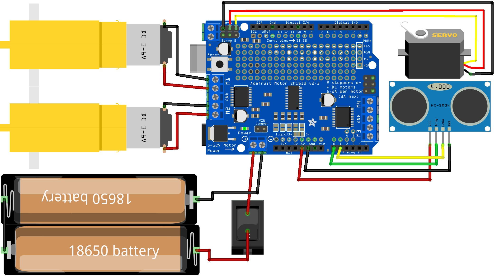

# Arduino Obstacle Avoiding Robot 🤖

## 📌 Project Description

This project demonstrates a simple **Arduino-based obstacle avoiding robot** using an **ultrasonic sensor**, **servo motor**, and **DC motors**. The ultrasonic sensor mounted on a servo scans the surroundings to detect obstacles, and the robot automatically decides the best direction to move by controlling the motors through an **L293D Motor Shield**.

This project is suitable for beginners who want hands-on experience with Arduino, sensors, motor control, and basic robotics concepts.

---

## 🖼️ Project Diagram

  

 

---

## 🧰 Components Required

* Arduino UNO Board x 1
* L293D Motor Shield x 1
* Ultrasonic Sensor (HC-SR04) with mounting bracket x 1
* Servo Motor x 1
* DC Geared Motors x2
* Wheels x 2
* A small piece of cardboard (for robot structure)
* Jumper Wires
* Switch x 1
* Double Battery Holder with DC Jack & Switch x 1
* 3.7V Rechargeable Batteries (lithium ion) x 2

---

## 📥 Install via Library Manager (Recommended Method)

1. Open **Arduino IDE**
2. Press **Ctrl + Shift + I** to open **Library Manager**
3. In the search box, type each library name:

   * AFMotor
   * NewPing
   * Servo
4. Click **Install** if not installed
5. If already installed, check for **updates** and update them if available

⚠️ If errors appear after installation:

* Close Arduino IDE completely
* Reopen it and try again

---

## 📥 How to Install Libraries Using ZIP Files

The following libraries **must be installed** in the Arduino IDE before compiling and uploading the code.

* **AFMotor** [[Download](https://github.com/adafruit/Adafruit_Motor_Shield_V2_Library)]
* **NewPing** [[Download](https://bitbucket.org/teckel12/arduino-new-ping/wiki/Home)]
* **Servo** [[Download](https://github.com/arduino-libraries/Servo)]

1. Download each library as a **ZIP file** from the links above
2. Open **Arduino IDE**
3. Go to **Sketch → Include Library → Add .ZIP Library...**
4. Select the downloaded `.zip` file and click **Open**
5. Repeat the same steps for all three libraries

Once installed, Arduino IDE will show a confirmation message.

---

## 🔍 How to Verify Library Installation

1. Open **Arduino IDE**
2. Go to **File → Examples**
3. Scroll down to **Examples from Custom Libraries**
4. If **AFMotor**, **NewPing**, and **Servo** appear there, the installation was successful

---

## ⚙️ Working Principle

1. The ultrasonic sensor continuously measures the distance to obstacles
2. The servo motor rotates the ultrasonic sensor to scan left and right
3. Arduino processes the distance data and decides the safest direction
4. The L293D Motor Shield controls the DC motors to move forward, backward, or turn

---

## 🚀 Applications

* Obstacle avoiding robots
* Beginner Arduino robotics projects
* Educational demonstrations
* Autonomous mobile robots

---

## 📝 Notes

* Ensure all wiring connections are correct before powering the robot
* Use fully charged 3.7V rechargeable batteries for stable operation
* Distance thresholds can be adjusted in the code if required
