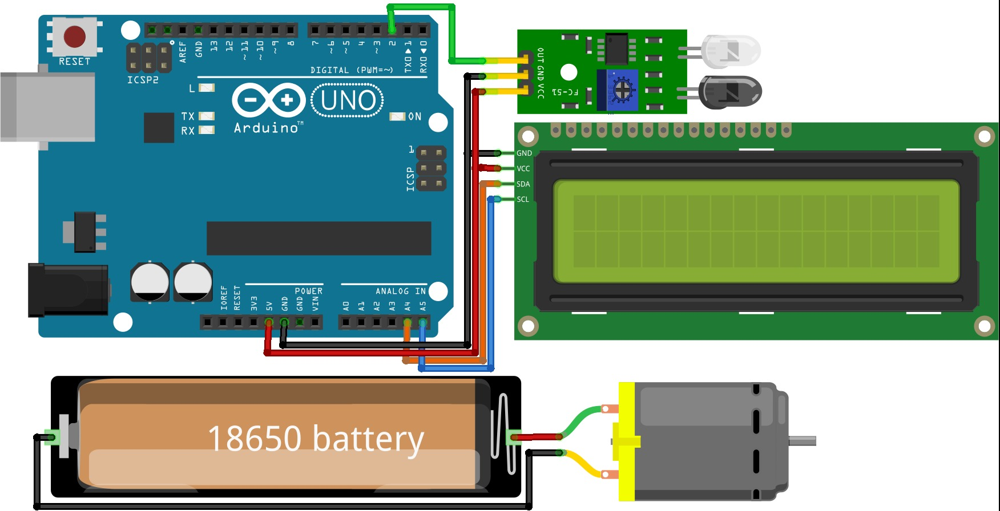

# IR Sensor RPM Counter with LCD Display ⏳

## 📌 Project Description

This project demonstrates a simple **RPM (Revolutions Per Minute) counter** using an **Arduino UNO**, an **IR sensor**, a **DC motor with a black disc**, and a **16x2 I2C LCD display**. The IR sensor detects rotations of the black disc attached to the motor shaft, and the Arduino calculates the RPM value and displays it on the LCD in real time.

This project is suitable for beginners who want to learn about:

* Using IR sensors
* Interfacing I2C LCD displays
* Basic motor rotation measurement
* Arduino libraries and hardware integration

## 🖼️ Project Diagram

<p align="center">
  
</p> 

---

## 🧰 Components Required

The following components are **mandatory** for this project:

* Arduino UNO Board x 1
* IR Sensor x 1
* 16x2 LCD Display with I2C Module x 1
* Motor & Black Disc x 1
* Battery Holder x 1
* 3.7V Rechargeable Batteries (lithium ion) x 1 
* Some Jumper Wires

---

## 📥 Library Requirement (Important)

This project **requires** the `LiquidCrystal_I2C` library to be installed in the Arduino IDE.

### ⬇️ How to Install the Library

1. Open **Arduino IDE**
2. Press **Ctrl + Shift + I** to open the **Library Manager**
3. In the **Search box**, type:

   ```
   LiquidCrystal I2C
   ```
4. Install the library if it is not installed
5. If it is already installed, check for **updates** and update if available

### 🔍 Verify Installation

* Go to **File → Examples**
* Scroll down and check for **Examples from Custom Libraries**
* If `LiquidCrystal_I2C` examples are visible, the library is installed correctly

### ⚠️ If Errors Occur

* Close the Arduino IDE
* Reopen it and try again
* Make sure there are no multiple conflicting LCD libraries installed

---

## ⚙️ How It Works

* The IR sensor detects each rotation of the black disc attached to the motor
* Arduino counts the pulses from the IR sensor
* RPM is calculated based on pulse count over time
* The calculated RPM value is displayed on the 16x2 I2C LCD

---

## 📝 Notes

* Adjust the IR sensor position to ensure accurate detection
* Ensure the black disc has a clear contrast for better IR sensing
* Use proper wiring to avoid loose connections