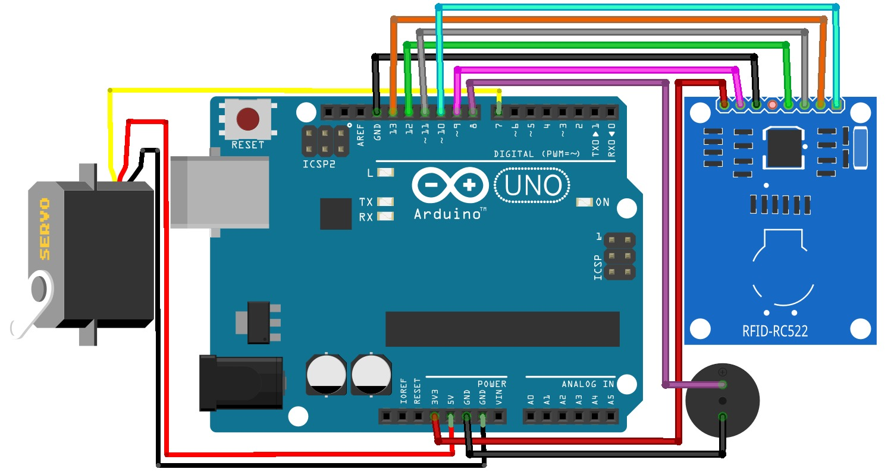

# 🔐 RFID Door Lock System

This project demonstrates an **Arduino UNO based RFID Access Control System** using an **RFID Reader**, **Servo Motor**, and **Buzzer**.  
When a valid RFID card is scanned, the servo motor rotates (simulating a door lock mechanism) and the buzzer gives feedback.

---

## 🧩 Components Required (Mandatory)

| Component | Quantity |
|---------|----------|
| Arduino UNO Board | 1 |
| Servo Motor | 1 |
| Buzzer | 1 |
| RFID Reader (MFRC522) | 1 |
| RFID Cards | 2 |
| Breadboard | 1 |
| Jumper Wires | As required | 
| Double Battery Holder | 1 |
| DC Jack | 1 |
| Switch | 1 |
| 3.7V Lithium ion Batteries | 2 |

---

## 🖼️ Project Diagram

  

 

---

## 📚 Required Arduino Libraries (Important ⚠️)

The following libraries **must be installed** before uploading the code:

- **Servo Library**
- **MFRC522 RFID Library**

### ✅ How to Check if Libraries Are Installed
1. Open **Arduino IDE**
2. Go to **File → Examples**
3. Scroll down and check for **Examples from Custom Libraries**
4. If `Servo` and `MFRC522` are listed, the libraries are correctly installed

### 🔧 How to Install / Update Libraries
1. Open **Arduino IDE**
2. Press **Ctrl + Shift + I** to open **Library Manager**
3. In the **Search Box**, type:
   - `Servo`
   - `MFRC522`
4. Install the libraries if not installed
5. If already installed, check for **updates** and update them
6. If errors appear after installation:
   - Close Arduino IDE
   - Reopen Arduino IDE and try again

---

## 🔋 Power System Connection

1. The **Double Battery Holder** has:
   - **Red Wire** → Positive (+)
   - **Black Wire** → Negative (−)
2. Connect:
   - **Red wire** from Battery Holder → **One pin of the Switch**
   - **Other pin of the Switch** → **Positive (+) pin of DC Jack**
   - **Black wire** from Battery Holder → **Negative (−) pin of DC Jack**

This setup allows safe power control using the switch.

---

## 🔌 Circuit Connections

### 📡 RFID Reader to Arduino UNO

1. Mount the **RFID Reader** on the **Breadboard**
2. Make the following connections:

| RFID Pin | Arduino Pin |
|--------|-------------|
| SDA    | Digital Pin 10 |
| SCK    | Digital Pin 13 |
| MOSI   | Digital Pin 11 |
| MISO   | Digital Pin 12 |
| GND    | Digital Pin GND |
| RST    | Digital Pin 9 |
| 3.3V   | Power Pin 3.3V |

---

### ⚙️ Servo Motor to Arduino UNO

| Servo Wire Color | Arduino Pin |
|-----------------|-------------|
| Orange / Yellow | Digital Pin 7 |
| Red             | Power Pin 5V |
| Brown           | Power Pin GND |

---

### 🔊 Buzzer to Arduino UNO

1. Use **Male-to-Female jumper wires**
2. Connect as follows:

| Buzzer Pin | Arduino Pin |
|-----------|-------------|
| Positive (+) | Digital Pin 8 |
| Negative (−) | Power Pin GND |

---

## 🚀 How the System Works

1. Power ON the system using the **switch**
2. RFID reader waits for a card
3. When a **valid RFID card** is scanned:
   - Servo motor rotates (door unlock simulation)
   - Buzzer beeps
4. When an **invalid card** is scanned:
   - Access is denied
   - Buzzer gives alert sound

---

## 🛠️ Applications

- Smart Door Lock Systems
- Attendance Systems
- Secure Access Control
- Arduino Learning Projects